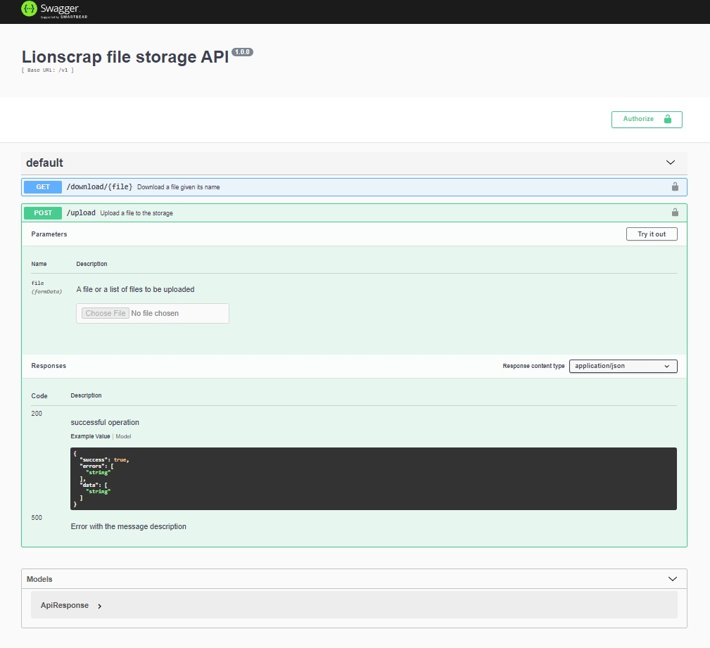

# Api for upload files to google cloud storage


### Small API for upload and download file to google cloud storage, the api works as intermediate layer between a client and google cloud storage.

`http(s)://{yourserver}/v1/api-docs`


### This project is at the beginning of the first stage and should be used under your own risks.




### How to setup:

* git clone  `https://github.com/josemojena/liontudeapi-gcs.git`
* execute `cd liontudeapi-gcs && npm install`
* execute `npm start`


### Configure env variables:

```
GOOGLE_APPLICATION_CREDENTIALS={google-file-credential}.json
GOOGLE_PROJECT_ID={project-Id}
GOOGLE_BUCKET_NAME={bucket-name}
ALLOWED_EXTENSIONS=.csv,.pdf
AUTHORIZED_KEYS=d_pl>J$8x-Qla)5,Cqa7?D0i4Tk<=Zi
```


Note: *At this moment we are not using any security schema rather than a static key for each user of the API(we change that very soon)*.
